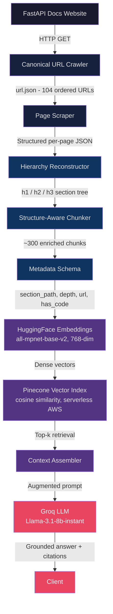

# DocStructRAG: Structure-Aware Documentation RAG Pipeline


A production-oriented Retrieval-Augmented Generation (RAG) system built over the official FastAPI documentation. The project is built on a single, opinionated thesis: **retrieval quality determines answer quality**. Every architectural decision — from the custom crawler to the metadata schema — is a direct consequence of that belief.

---

## Problem Statement

Off-the-shelf RAG pipelines apply generic document loaders and token-window chunking to documentation. This destroys the structural information that makes documentation useful: section hierarchy, the co-location of code examples with their prose explanations, and the canonical ordering of pages.

The result is a retrieval index that returns fragments — disconnected sentences, orphaned code blocks, partial definitions — producing answers that hallucinate or contradict the source.

This project solves that by treating documentation structure as a first-class engineering constraint.

---

## System Architecture



---

## Key Engineering Decisions

| # | Decision | Rationale |
|---|---|---|
| 1 | **Canonical URL crawler** over sitemap or DFS | FastAPI docs use `<link rel="canonical">` + `<link rel="next">` to define a canonical reading order. Following these guarantees a stable, deduplicated, ordered URL list — a prerequisite for deterministic hierarchy reconstruction. |
| 2 | **Typed DOM walker** over `get_text()` or markdownify | Classifies every node (`heading`, `text`, `list_item`, `code`) by tag and CSS class. Separates tabbed code panels from inline highlights, strips admonition noise, and preserves indentation with `CODE` / `/CODE` sentinels — all silently lost by flat-text extraction. |
| 3 | **Section-boundary chunking** over token windows | Each chunk maps to one semantic unit: a heading plus its prose and code. Keeps explanations and examples co-located so retrieval returns complete context, not orphaned fragments. |
| 4 | **Rich metadata schema** (`section_path`, `depth`, `url`, `has_code`) | Enables filtered retrieval beyond embedding similarity — e.g., restrict to code-heavy chunks, or surface the exact breadcrumb for citation grounding. Smaller LLMs respond better with tighter, scoped context. |
| 5 | **`all-mpnet-base-v2` + Pinecone serverless** | Top-performing dense retrieval model without GPU inference; cosine metric is correct for normalized embeddings. Serverless tier removes pod-sizing overhead during the research phase. |
| 6 | **Provisional LLM (`Llama-3.1-8b-instant`)** | LLM selection deferred until retrieval is validated. Benchmarking generation quality against a weak retrieval baseline produces misleading signals; final model choice gates on RAGAS results. |

---

## What Was Built From Scratch

| Component | Decision |
|---|---|
| Canonical URL crawler | No sitemap; uses `<link rel="canonical">` + `<link rel="next">` traversal |
| Typed DOM parser | Walks descendants; classifies each node by tag and CSS class |
| Code block normalizer | Strips whitespace noise, preserves indentation, adds sentinels |
| Metadata schema | `section_path`, depth, URL, code flag per chunk |

Standard library components (LangChain, Pinecone SDK, HuggingFace) handle embedding, vector storage, and LLM invocation.

---

## Impact

- **104 FastAPI documentation pages** crawled, parsed, and indexed with zero loss of code blocks or section hierarchy
- **~300 structure-aligned chunks** produced, each carrying full section-path metadata for citation grounding
- Retrieval operates over 768-dimensional dense embeddings with cosine similarity in a serverless vector index — no infrastructure to manage during development
- Answers include source URLs and section breadcrumbs, making the system auditable rather than opaque

---

## How to Run

### Prerequisites

- Python 3.10+
- A [Pinecone](https://www.pinecone.io/) account and API key (free tier is sufficient)
- A [Groq](https://console.groq.com/) API key (free tier is sufficient)

### Setup

```bash
# Clone the repository
git clone https://github.com/your-username/doc-struct-rag.git
cd doc-struct-rag

# Create and activate a virtual environment
python -m venv venv
source venv/bin/activate        # Linux / macOS
venv\Scripts\activate           # Windows

# Install dependencies
pip install -r requirements.txt
```

Create a `.env` file in the project root:

```
PINECONE_API_KEY=your_pinecone_api_key
HUGGINGFACE_API_KEY=your_huggingface_api_key
GROQ_API_KEY=your_groq_api_key
```

### Step 1: Crawl Documentation URLs

```bash
python -m scraping.url_crawl
# Produces: url.json (104 ordered FastAPI documentation URLs)
```

### Step 2: Scrape and Parse All Pages

Open `scraping_notebook.ipynb` and run the pipeline cell, or use the module directly:

```python
from scraping.scraping_pipeline import scrape_all_pages
import json

with open("url.json") as f:
    url_list = json.load(f)

scrape_all_pages("https://fastapi.tiangolo.com/", url_list)
# Produces: document.json (structured, hierarchy-aware page content)
```

### Step 3: Embed and Index

The `rag.py` module handles embedding and Pinecone upsert. Uncomment the upsert loop in `rag.py` and run:

```bash
python rag.py
# Embeds chunks with all-mpnet-base-v2 and upserts into Pinecone
```

### Step 4: Query the System


## Project Structure

```
doc-struct-rag/
├── scraping/
│   ├── url_crawl.py                  # Canonical-aware documentation crawler
│   ├── scrape_page.py                # Typed DOM parser with code normalization
│   ├── scraping_pipeline.py          # Orchestrates multi-page scrape to document.json
│   └── webscrape.py                  # Generic page text extractor (prototype utility)
├── rag.py                            # Embedding, Pinecone indexing, and generation chain
├── main.py                           # FastAPI REST interface (POST /api/rag)
├── requirements.txt
└── scraping_notebook.ipynb           # Exploratory pipeline notebook
```

---

## In Progress

| Item | Status | Notes |
|---|---|---|
| Evaluation with RAGAS | Active | Measuring context precision, answer faithfulness, and recall against ground-truth QA pairs |
| Metadata-filtered retrieval | Active | Implementing `has_code` and `depth` filters in Pinecone query calls |
| Multi-turn conversation | Planned | Stateful chatbot with session-level context window management |
| LLM benchmarking | Planned | Comparing Llama-3.1-8b vs. larger models on faithfulness vs. latency; final model selection gates on RAGAS results |
| Dockerized deployment | Planned | Single container for API server; Pinecone remains external managed service |
| Usage analytics | Planned | Query logging and retrieval latency tracking per request |
| Code refactor | Planned | Separating pipeline stages into modular CLI commands; removing prototype scripts from production path |

---

## Stack

| Layer | Technology |
|---|---|
| Crawling + Parsing | Python, Requests, BeautifulSoup4 |
| Chunking | Custom hierarchy-aware strategy |
| Embeddings | sentence-transformers/all-mpnet-base-v2 (HuggingFace) |
| Vector Database | Pinecone Serverless (AWS us-east-1, cosine) |
| LLM | Llama-3.1-8b-instant via Groq |
| Orchestration | LangChain (PromptTemplate, ChatModel, chain composition) |
| API | FastAPI + Uvicorn |
| Environment | python-dotenv |

---

## License

MIT
