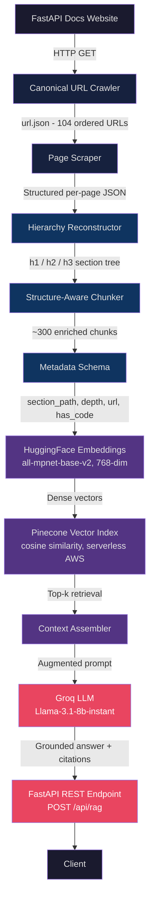

# DocStructRAG: Structure-Aware Documentation RAG Pipeline

A production-oriented Retrieval-Augmented Generation (RAG) system built over the official FastAPI documentation. The project is built on a single, opinionated thesis: **retrieval quality determines answer quality**. Every architectural decision — from the custom crawler to the metadata schema — is a direct consequence of that belief.

---

## Problem Statement

Off-the-shelf RAG pipelines apply generic document loaders and token-window chunking to documentation. This destroys the structural information that makes documentation useful: section hierarchy, the co-location of code examples with their prose explanations, and the canonical ordering of pages.

The result is a retrieval index that returns fragments — disconnected sentences, orphaned code blocks, partial definitions — producing answers that hallucinate or contradict the source.

This project solves that by treating documentation structure as a first-class engineering constraint.

---

## System Architecture



---

## Key Engineering Decisions

### 1. Custom Crawler with Canonical URL Resolution

Generic crawlers follow `href` links and produce duplicate or out-of-order pages. The FastAPI documentation uses canonical `<link rel="canonical">` and `<link rel="next">` tags to define an authoritative reading order across 104 pages.

The crawler (`scraping/url_crawl.py`) explicitly processes canonical redirects before following `next` links, resolves absolute URLs to relative paths for portability, and terminates on a configurable stop path without requiring a sitemap. This guarantees a stable, ordered, deduplicated URL list — a prerequisite for deterministic retrieval.

**Trade-off considered:** Using a sitemap or a recursive DFS crawler would be faster to write but would produce an unordered, potentially duplicated URL list. Order is load-bearing here because the hierarchy reconstructor depends on a consistent page sequence.

### 2. Structure-Preserving HTML Parser

The scraper (`scraping/scrape_page.py`) walks the DOM as a typed content stream rather than calling `get_text()`. Every node is classified as one of: `heading` (h1–h6 with level preserved), `text` (paragraph), `list_item`, or `code`. Admonition blocks (`note`, `tip`, `info`) are intentionally excluded because they are navigational noise, not semantic content.

Code blocks receive a dedicated normalization pass: leading/trailing blank lines are stripped, internal multi-blank-line sequences are collapsed to one, indentation is preserved exactly. Code is then delimited with `CODE / /CODE` sentinels for unambiguous downstream identification.

**Trade-off considered:** Using an existing parser like `markdownify` would require a conversion round-trip that loses `class`-level distinctions between tabbed code panels (`tabbed-content`) and inline highlights (`highlight`). Both are handled separately in the parser, preserving code that would otherwise be silently dropped.

### 3. Hierarchy-Aware Chunking

Documentation is not prose. Token-window chunking cuts across section boundaries, splitting explanations from the code that implements them. The chunking strategy follows heading boundaries so that each chunk contains one semantic unit: a heading plus its associated text and code.

This keeps retrieval precise. When a user asks about dependency injection, the retrieved chunk contains the explanation and the illustrative example together — not two separate fragments from different parts of the window.

### 4. Metadata Schema for Filtered and Citation-Aware Retrieval

Each chunk carries structured metadata: `section_path` (the full heading breadcrumb, e.g., `FastAPI > Path Parameters > Path Parameters with Types`), `depth` (1–6), source `url`, and a `has_code` flag.

This enables retrieval that is aware of context beyond embedding similarity:

- A query about code examples can filter to `has_code = true` chunks, reducing context noise.
- Every answer can be grounded with a source URL and section path, making citations reliable rather than approximate.
- Smaller LLMs perform better with less context noise; metadata filtering is a direct lever on context quality.

### 5. Embedding and Vector Storage Selection

`sentence-transformers/all-mpnet-base-v2` (768 dimensions) is used for embedding. It is the best-performing general-purpose dense retrieval model in the `sentence-transformers` family without requiring GPU inference, making it viable for local development and cost-controlled production.

Pinecone serverless (AWS `us-east-1`, cosine metric) is used as the vector database. The serverless tier eliminates pod sizing decisions during the research phase, and the cosine metric is appropriate for normalized sentence embeddings where magnitude is not a semantic signal.

### 6. Deliberate Deferral of LLM Selection

`Llama-3.1-8b-instant` via Groq is used as the current generation model. The choice is explicitly provisional. LLM selection was deferred until retrieval quality stabilized, because evaluating generation quality against a weak retrieval baseline produces misleading signals about model capability.

Once RAGAS evaluation is complete, model size and provider will be chosen based on measured faithfulness and latency, not prior assumptions.

---

## What Was Built From Scratch

| Component | Decision |
|---|---|
| Canonical URL crawler | No sitemap; uses `<link rel="canonical">` + `<link rel="next">` traversal |
| Typed DOM parser | Walks descendants; classifies each node by tag and CSS class |
| Code block normalizer | Strips whitespace noise, preserves indentation, adds sentinels |
| Metadata schema | `section_path`, depth, URL, code flag per chunk |
| FastAPI REST interface | `POST /api/rag` wraps the full retrieval-generation chain |

Standard library components (LangChain, Pinecone SDK, HuggingFace) handle embedding, vector storage, and LLM invocation.

---

## Impact

- **104 FastAPI documentation pages** crawled, parsed, and indexed with zero loss of code blocks or section hierarchy
- **~300 structure-aligned chunks** produced, each carrying full section-path metadata for citation grounding
- Retrieval operates over 768-dimensional dense embeddings with cosine similarity in a serverless vector index — no infrastructure to manage during development
- Answers include source URLs and section breadcrumbs, making the system auditable rather than opaque

---

## How to Run

### Prerequisites

- Python 3.10+
- A [Pinecone](https://www.pinecone.io/) account and API key (free tier is sufficient)
- A [Groq](https://console.groq.com/) API key (free tier is sufficient)

### Setup

```bash
# Clone the repository
git clone https://github.com/your-username/doc-struct-rag.git
cd doc-struct-rag

# Create and activate a virtual environment
python -m venv venv
source venv/bin/activate        # Linux / macOS
venv\Scripts\activate           # Windows

# Install dependencies
pip install -r requirements.txt
```

Create a `.env` file in the project root:

```
PINECONE_API_KEY=your_pinecone_api_key
HUGGINGFACE_API_KEY=your_huggingface_api_key
GROQ_API_KEY=your_groq_api_key
```

### Step 1: Crawl Documentation URLs

```bash
python -m scraping.url_crawl
# Produces: url.json (104 ordered FastAPI documentation URLs)
```

### Step 2: Scrape and Parse All Pages

Open `scraping_notebook.ipynb` and run the pipeline cell, or use the module directly:

```python
from scraping.scraping_pipeline import scrape_all_pages
import json

with open("url.json") as f:
    url_list = json.load(f)

scrape_all_pages("https://fastapi.tiangolo.com/", url_list)
# Produces: document.json (structured, hierarchy-aware page content)
```

### Step 3: Embed and Index

The `rag.py` module handles embedding and Pinecone upsert. Uncomment the upsert loop in `rag.py` and run:

```bash
python rag.py
# Embeds chunks with all-mpnet-base-v2 and upserts into Pinecone
```

### Step 4: Start the API Server

```bash
uvicorn main:app --reload
```

The server starts at `http://127.0.0.1:8000`.

### Step 5: Query the System

```bash
curl -X POST "http://127.0.0.1:8000/api/rag?query=How+do+I+use+path+parameters+in+FastAPI"
```

API documentation is auto-generated at `http://127.0.0.1:8000/docs`.

---

## Project Structure

```
doc-struct-rag/
├── scraping/
│   ├── url_crawl.py                  # Canonical-aware documentation crawler
│   ├── scrape_page.py                # Typed DOM parser with code normalization
│   ├── scraping_pipeline.py          # Orchestrates multi-page scrape to document.json
│   └── webscrape.py                  # Generic page text extractor (prototype utility)
├── rag.py                            # Embedding, Pinecone indexing, and generation chain
├── main.py                           # FastAPI REST interface (POST /api/rag)
├── requirements.txt
└── scraping_notebook.ipynb           # Exploratory pipeline notebook
```

---

## In Progress

| Item | Status | Notes |
|---|---|---|
| Evaluation with RAGAS | Active | Measuring context precision, answer faithfulness, and recall against ground-truth QA pairs |
| Metadata-filtered retrieval | Active | Implementing `has_code` and `depth` filters in Pinecone query calls |
| Multi-turn conversation | Planned | Stateful chatbot with session-level context window management |
| LLM benchmarking | Planned | Comparing Llama-3.1-8b vs. larger models on faithfulness vs. latency; final model selection gates on RAGAS results |
| Dockerized deployment | Planned | Single container for API server; Pinecone remains external managed service |
| Usage analytics | Planned | Query logging and retrieval latency tracking per request |
| Code refactor | Planned | Separating pipeline stages into modular CLI commands; removing prototype scripts from production path |

---

## Stack

| Layer | Technology |
|---|---|
| Crawling + Parsing | Python, Requests, BeautifulSoup4 |
| Chunking | Custom hierarchy-aware strategy |
| Embeddings | sentence-transformers/all-mpnet-base-v2 (HuggingFace) |
| Vector Database | Pinecone Serverless (AWS us-east-1, cosine) |
| LLM | Llama-3.1-8b-instant via Groq |
| Orchestration | LangChain (PromptTemplate, ChatModel, chain composition) |
| API | FastAPI + Uvicorn |
| Environment | python-dotenv |

---

## License

MIT
